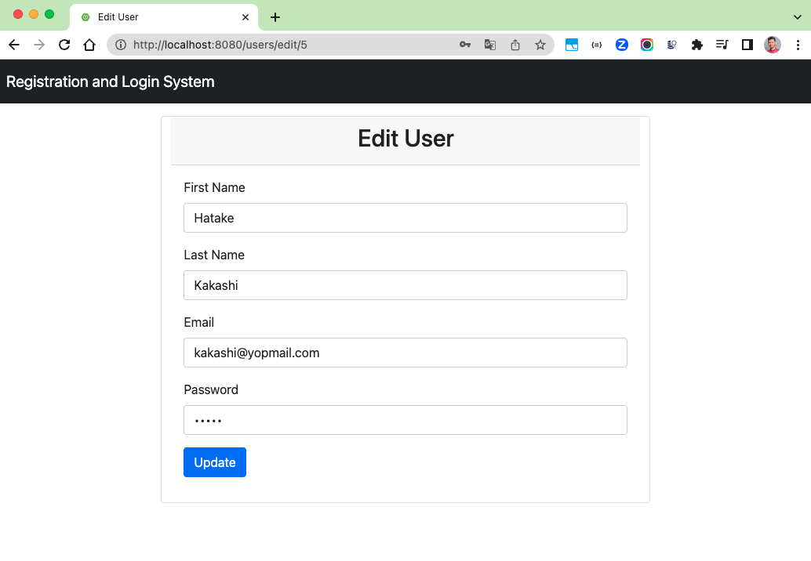

# spring-boot3-registration-login

### Things to do list:

1. Clone this repository: `git clone https://github.com/hendisantika/spring-boot3-registration-login.git`
2. Navigate to the folder: `cd spring-boot3-registration-login`
3. Run the application: `mvn clean spring-boot:run`
4. Open your favorite browser: http://localhost:8080

### Image Screen shot 

Register User

User Login

List Users

Edit User

